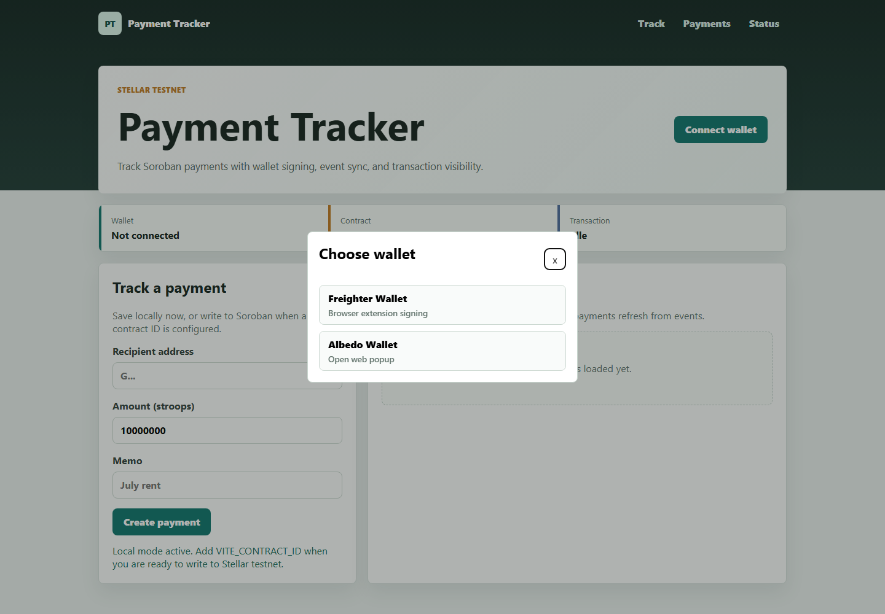

# Payment Tracker

Level 2 Stellar payment tracker with Freighter and Albedo wallet connection, Soroban contract calls, transaction status tracking, and frontend state synchronization.

## Features

- Multi-wallet Stellar testnet signing with Freighter and Albedo.
- Wallet selection popup.
- Handles wallet not found, rejected request, and insufficient balance errors.
- Soroban testnet contract for creating and listing payment records.
- Contract stores payment sender, recipient, amount, memo, and status.
- Frontend contract write and read paths.
- Contract event polling that refreshes frontend state after new payment events.
- Pending, success, and failed transaction status with Stellar Explorer links.

## Setup

Run the frontend locally:

```powershell
cd Frontend
npm.cmd install
Copy-Item .env.example .env
npm.cmd run build
npm.cmd run dev
```

You can also deploy the `Frontend` folder to Netlify/Vercel as a static site.

To build and deploy the contract:

```powershell
cd Backend
cargo test
stellar contract build
stellar contract deploy --wasm target/wasm32-unknown-unknown/release/payment_tracker.wasm --source YOUR_TESTNET_IDENTITY --network testnet
```

After deployment, add the contract id to `Frontend/.env`:

```env
VITE_CONTRACT_ID=YOUR_DEPLOYED_TESTNET_CONTRACT_ID
```

When a wallet is connected, the frontend polls testnet contract events every five seconds and reloads `list_payments` when a new contract event appears.

## Submission Values

- GitHub repository: `https://github.com/Sagar522290/Payment-Tracker`
- Live demo: `https://payment-tracker-blush.vercel.app`
- Deployed contract address: pending real Stellar testnet deployment
- Verifiable contract call transaction hash: pending successful `create_payment` testnet transaction

The contract source is complete, but no deployed Stellar testnet contract id or successful testnet transaction hash is committed to this repository yet. These two values must be generated from a funded Stellar testnet wallet and verified on Stellar Expert before final submission.

## Requirement Checklist

- Multi-wallet support: Freighter and Albedo are implemented.
- Stellar Testnet smart contract: source is included in `Backend/contracts/payment-tracker`.
- Contract status: shows Local mode until `VITE_CONTRACT_ID` is configured.
- Create and view payments: frontend saves local demo payments without a contract, then writes `create_payment` and reads `list_payments` after deployment.
- Read/write contract data: implemented through Soroban RPC simulation and signed transactions.
- Transaction status: Pending, Success, and Failed states are shown with Stellar Expert links.
- Error handling: wallet not installed, rejected wallet request, and insufficient balance/fee errors are handled.
- Real-time updates: frontend refreshes from contract events after successful writes.
- Responsive UI: layout adapts for mobile and desktop.
- Screenshot: wallet options screenshot is included below.
- Commit history: repository has 2+ meaningful commits.
- README: setup instructions are included; deployment evidence section documents the missing real testnet contract id and transaction hash.

## Deployment Status

- Frontend builds successfully with Vite.
- Contract deployment still requires Rust/Cargo, Stellar CLI, and a funded Stellar testnet identity.
- Before deployment, the frontend runs in Local mode so the payment form can still be tested.
- After deployment, update the submission values above with the real contract id and a successful testnet transaction hash.

## Screenshots



## Notes

The app is ready for static hosting, but a real deployed contract id and a successful testnet transaction hash must come from your funded Stellar testnet wallet.
